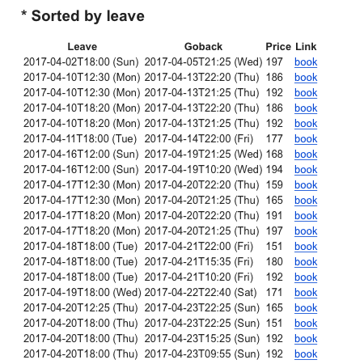

## Transavia API - 

Get an API key + see documentation [here](https://developer.transavia.com)

Setup environment variables in .bashrc / shell .login file: 

	export TRANSAVIA_KEY=your_key
	export FROM_MAIL=from_email
	export TO_MAIL=to_email

Basic interface:

	$ python transavia.py
	Usage: transavia.py from_airport to_airport days_stay (timerange, default=0800-2200) (maxprice, default=200)
	Use airport codes for from / to: http://bit.ly/2ohU0H4

For example: get all flights coming 3 months from Amsterdam to Alicante, for a stay of 4 days:

	$ python transavia.py AMS ALC 4

Mails out this report:

... more rows ...

